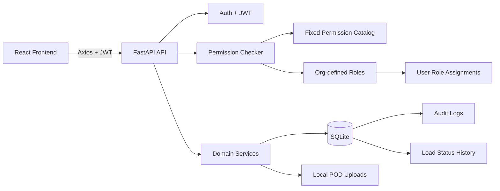
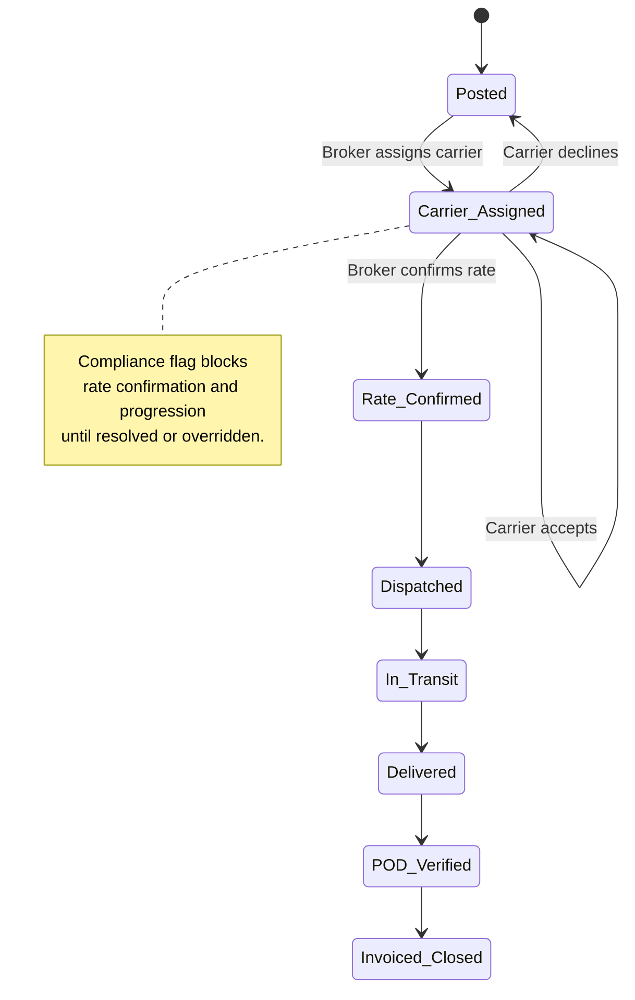
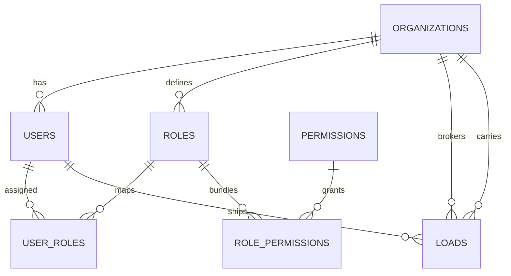

# LoadFlow

LoadFlow is a freight brokerage operations suite for managing loads, carrier compliance, role-based permissions, rate confirmations, shipment status, PODs, and audit history.

This project was built for a take-home hackathon brief. The main goal is to show a working, server-enforced RBAC system rather than a UI-only demo.

## Highlights

- JWT authentication for Broker, Carrier, and Shipper accounts.
- Broker and Carrier organizations with admin-managed staff.
- Custom roles built from a fixed permission catalog.
- Server-side permission checks by permission code, not role name.
- Organization and object-level scoping.
- Load lifecycle from `Posted` to `Invoiced/Closed`.
- Carrier compliance checks for insurance, authority, equipment, and commodities.
- Compliance flags that block progression past `Carrier Assigned`.
- Versioned rate confirmations.
- POD upload/view/verification.
- Audit log and load status history.
- Alembic migration scaffold for the current schema.
- Seeded demo dataset for fast walkthroughs.

## Tech Stack

| Area | Stack |
| --- | --- |
| Frontend | React 19, Vite, TypeScript, Axios, Lucide Icons |
| Backend | FastAPI, SQLAlchemy 2.0, Pydantic v2 |
| Auth | JWT access tokens, Passlib bcrypt hashing |
| Database | SQLite for local development |
| Migrations | Alembic |
| Tests | Pytest |
| Uploads | Local file storage for POD files |

## Architecture



## Domain Flow



## RBAC Model



The permission catalog is fixed:

- `load.create`
- `load.assign_carrier`
- `load.override_compliance_flag`
- `rate.confirm`
- `load.update_status`
- `staff.manage`
- `pod.upload`

Roles are database records containing permission bundles. The code checks permission codes, not role names. Demo roles such as Dispatcher or Driver are seed data only.

## Database Tables

| Table | Purpose |
| --- | --- |
| `organizations` | Broker and carrier organizations |
| `users` | Broker staff, carrier staff, and shipper users |
| `permissions` | Fixed permission catalog |
| `roles` | Admin-created roles |
| `role_permissions` | Permissions assigned to roles |
| `user_roles` | Roles assigned to users |
| `carrier_compliance` | Insurance, authority, equipment, commodities |
| `loads` | Main shipment/load records |
| `load_status_history` | Workflow history with timestamps and actor |
| `rate_confirmation_versions` | Versioned broker-carrier rate agreements |
| `pod_files` | Proof of Delivery uploads |
| `audit_logs` | Activity and permission-denied logs |
| `notifications` | Renewal and system notifications |

## Run Locally

### Backend

```bash
python -m venv env
env\Scripts\activate
pip install -r requirements.txt
alembic upgrade head
uvicorn backend.app.main:app --reload
```

API:

```text
http://localhost:8000
```

Swagger docs:

```text
http://localhost:8000/docs
```

### Frontend

```bash
cd frontend
npm install
npm.cmd run dev
```

Frontend:

```text
http://localhost:5173
```

PowerShell may block `npm.ps1`. Use `npm.cmd` if that happens:

```bash
npm.cmd run dev
npm.cmd run build
```

## Reset Local Database

For a clean demo database:

```bash
del loadflow.db
alembic upgrade head
uvicorn backend.app.main:app --reload
```

If you want to keep an existing database and only mark migrations as applied:

```bash
alembic stamp head
```

## Demo Accounts

All seeded users use:

```text
Password123
```

Passwords are not stored as plain text. They are hashed in `users.password_hash`.

| Account | Email |
| --- | --- |
| Broker Admin | `broker.admin@loadflow.test` |
| Broker Dispatcher | `dispatcher@loadflow.test` |
| Broker Ops Lead | `ops.lead@loadflow.test` |
| Broker Billing | `billing@loadflow.test` |
| Carrier Admin | `carrier.admin@loadflow.test` |
| Carrier Driver | `driver@loadflow.test` |
| Carrier Dispatch | `carrier.dispatch@loadflow.test` |
| Prairie POD Clerk | `prairie.pod@loadflow.test` |
| Shipper | `shipper@loadflow.test` |
| Evergreen Foods Shipper | `evergreen.foods@loadflow.test` |
| Metro Retail Shipper | `metro.retail@loadflow.test` |

## Seed Data

The app seeds a walkthrough-ready dataset when missing:

- 3 organizations: 1 broker and 2 carriers.
- 7 fixed permissions.
- 6 roles across broker and carrier organizations.
- 11 users across broker, carrier, and shipper account types.
- 2 carrier compliance records, including one lapsed carrier.
- 7 loads across multiple lifecycle states.
- Multiple rate confirmation versions.
- Load status history rows.
- Audit log rows.
- Notifications.
- One seeded POD file.

## Walkthrough Script

Use this flow for a 3-5 minute recording:

1. Start backend and frontend.
2. Log in as `broker.admin@loadflow.test`.
3. Show dashboard metrics, load board, search/filter, audit log.
4. Create a custom role from permission checkboxes.
5. Create a staff user.
6. Create a new load.
7. Assign a carrier with the carrier dropdown.
8. Show carrier compliance flag behavior on `LF-1006`.
9. Confirm a rate using the rate form.
10. Open a load drawer and show status history and audit events.
11. Log in as `driver@loadflow.test`.
12. Show carrier-only assigned loads, accept/decline, status actions, and POD upload.
13. Log in as `shipper@loadflow.test`.
14. Show that shippers only see their own loads.
15. Open `docs/ai_usage.md` and briefly explain how AI assistance was used.

## API Summary

| Area | Endpoints |
| --- | --- |
| Auth | `POST /api/v1/auth/login`, `GET /api/v1/auth/me` |
| Bootstrap | `POST /api/v1/bootstrap/admin` |
| Users | `POST /api/v1/users/staff`, `GET /api/v1/users/shippers` |
| Roles | `GET /api/v1/roles`, `POST /api/v1/roles` |
| Permissions | `GET /api/v1/permissions` |
| Loads | `GET/POST/PATCH/DELETE /api/v1/loads` |
| Carrier Decision | `POST /api/v1/loads/{id}/carrier-decision` |
| Rates | `POST /api/v1/loads/{id}/rate-confirmations`, `GET /api/v1/rates/{load_id}` |
| Compliance | `GET/POST /api/v1/compliance`, `DELETE /api/v1/compliance/{carrier_org_id}` |
| POD | `POST /api/v1/pod/{load_id}`, `POST /api/v1/pod/{load_id}/verify` |
| Audit | `GET /api/v1/audit`, `GET /api/v1/loads/{id}/audit` |
| History | `GET /api/v1/loads/{id}/history` |

## Tests

```bash
pytest backend/app/tests
```

Frontend production build:

```bash
cd frontend
npm.cmd run build
```

## Assumptions

- Shippers are individual accounts and do not have sub-roles.
- Broker and carrier admins are seeded for demo, but first-admin bootstrap is available.
- Local POD storage is acceptable for the take-home; production would use object storage.
- SQLite is used for speed and portability in local review.

## Known Limitations

- The app is optimized for take-home review, not production hardening.
- Alembic migration is included, but the app still auto-initializes the SQLite database for reviewer convenience.
- POD files are stored locally rather than in S3 or another object store.
- Deployment files are basic and would need environment-specific hardening for production.
